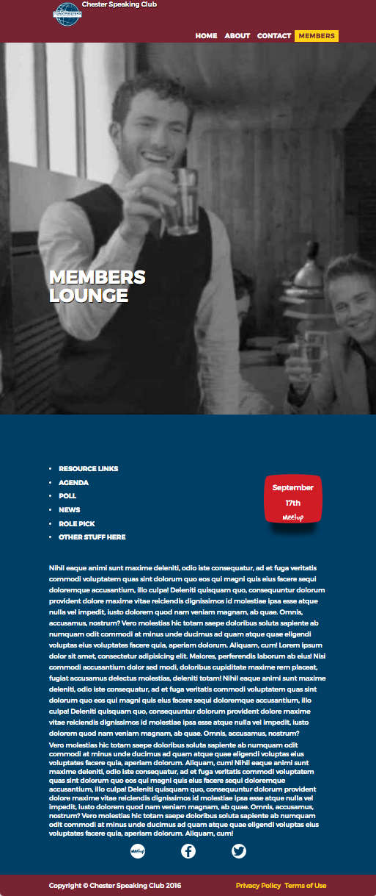

# ToastStatic
https://appijumbo.github.io/ToastStatic/

This was an initial static website design for a Toastmasters club website

This was known also known as 'Theme 3' when used later converted to a Wordpress version. 
It includes a members page though this was purely a dummy and subsequently removed to focus on quilfying new members.

Not that clicking the members tab in Github results in a '404'. You need to download this repo as say a zip file to see the members page.
For convenience here is what it would look like

